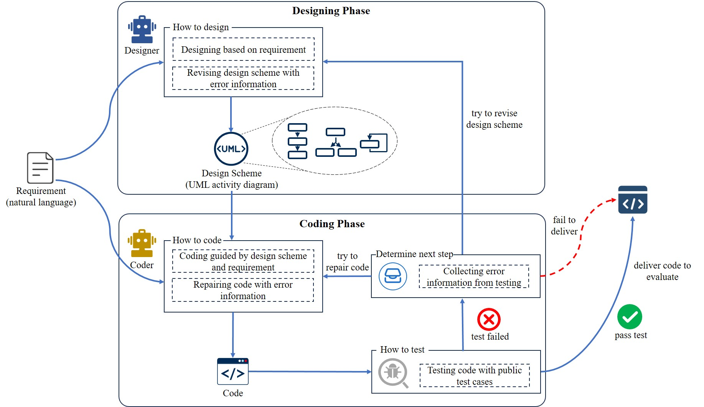

# StructGen 📐💻

<p align="center">
  <a href="#overview">📖Overview</a> •
  <a href="#prepare-environment">🧪Environment</a> •
  <a href="#testing-framework-configuration">📂Testing Framework Configuration</a> •
  <a href="#quick-start">🚀Quick Start</a> •
  <a href="#citation">📝Citation</a>
</p>

## 📖Overview

We propose a novel framework for function-level code generation, named **StructGen**, which employs the Unified Modeling Language (UML) activity diagrams as structure to model design schemes to guide code generation.

- **Designing Phase:** An LLM serves as the Designer, inferring the requirements and modeling the design schemes using UML activity diagrams. For each requirement, the Designer employs a UML activity diagram to logically organize the implementation process through sequential, selective, and iterative structures.
- **Coding Phase:** Another LLM operates as the Coder, generating code guided by the design schemes. 




## 🧪Prepare Environment

StructGen is developed on Ubuntu 24.04.1 LTS. Follow these steps to set up the Python environment:

```bash
conda create -n StructGen python=3.8
conda activate StructGen
pip install -r requirements.txt
```

Please set your API KEY in `generate/config.ini`. This file also contains numerous other configurable options to fine-tune the behavior of StructGen.

## 📂Testing Framework Configuration

Download the testing framework using the following commands:

```bash
cd StructGen
git clone https://github.com/openai/human-eval
pip install -e human-eval
```

Modify the `execute.py` file in the `human-eval` directory. Update the `unsafe_execute` function as follows:

```python
check_program = (
    completion
    + "\n"
    + problem["test"]
    + "\n"
    + f"check({problem['entry_point']})"
)
```

The testing framework is required for running the experiments and validating all generated code. Ensure that the directory structure matches the project requirements.

## 🚀Quick Start

Use the following command to perform code generation:

```bash
python generate_feedback.py \
    --model_name gpt-3.5-turbo-1106 \
    --uml_type plantuml \
    --dataset_name humaneval
```

The logs and the final results, are stored in the `results` directory. The generated content will be synchronized with the CSV file and ultimately consolidated into a JSONL file, saved in the `results` directory.

## 📝Citation

If you find the code helpful, please cite our paper:

```bibtex
@inproceedings{2024structgen,
  title     = {StructGen: A Novel Framework for Function-Level Code Generation with LLMs via UML Activity Diagrams},
  author    = {},
  booktitle = {The [Conference Name] 2025},
  year      = {2025}
}
```

---

This README provides an overview of StructGen, including setup instructions for the environment and dataset, a quick start guide, and citation information. 
